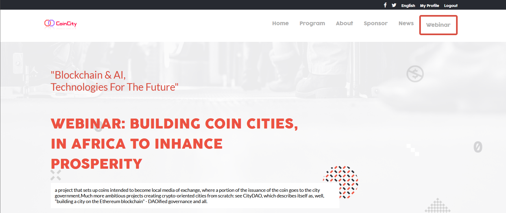
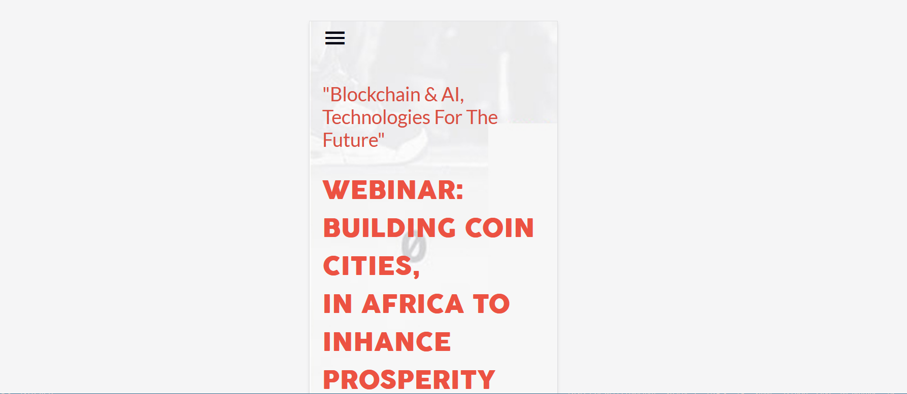

# Module 1 - Capstone Project

> Building my first Capstone project to apply the concepts learned in order to enhance my skills in HTML, CSS & JavaScript.





Additional description about the project and its features.

## Built With

- Major languages
- HTML
- JavaScript
- CSS

## Live Demo

[Live Demo Link](https://mwapsam.github.io/capstone-m1)

## Demo Video Link

[Watch Demo](https://www.loom.com/share/a8a80561e3474f7a9e21b2140f9e4d65)

## Getting Started

**To get a copy of this repo into your local machine run the following command:**

```
git clone https://github.com/Mwapsam/capstone-m1
cd capstone-m1
in visual studio code you can click the go live button to view it live in the browser.
```

## Author

👤 **Samuel Chimfwembe**

- GitHub: [@Mwapsam](https://github.com/Mwapsam)

## 🤝 Contributing

Contributions, issues, and feature requests are welcome!
Feel free to check the [issues page](../../issues/).

## Show your support

Give a ⭐️ if you like this project!

## Acknowledgments

- Original design idea by
  [Cindy Shin in Behance](https://www.behance.net/adagio07)

## 📝 License

This project is [MIT](./MIT.md) licensed.
